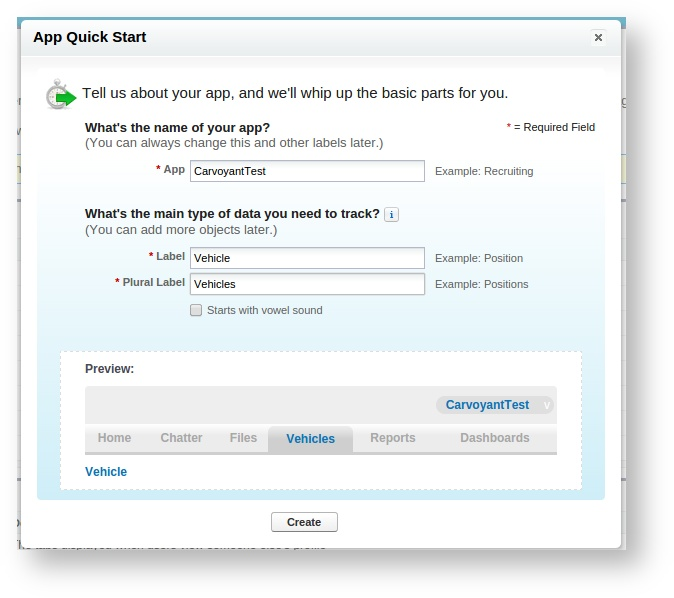
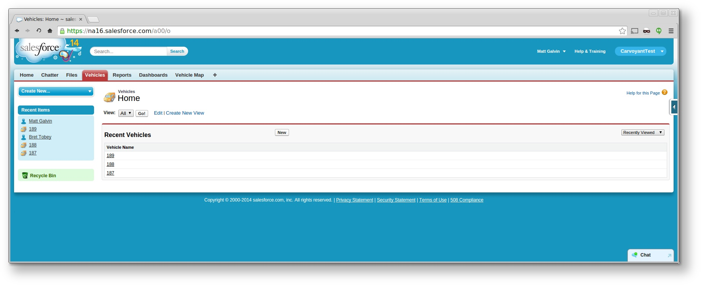

Force.com
=========

Overview
--------

At the end of this walk through, you will have created a map within your Force.com application that updates the position of vehicles from your Carvoyant account as they travel around.  The end screen will look similar to this:

.. image:: salesforce-vehiclemap.png

You will be able to use the Carvoyant traffic simulator to simulate a trip for any of the vehicles and the map within the Force.com application will be updated with the new locations of the vehicle.

Note that this how-to will use a trial Force.com account for any screenshots so your actual account may look differently depending on how you have it customized.

Step 1 - Create the CarvoyantTest Application
---------------------------------------------

Log in to your account and create a new application.  Under the Setup screen click the green "Add App" button.

Use the following values:

+--------------+---------------+
| App          | CarvoyantTest |
+--------------+---------------+
| Label        | Vehicle       |
+--------------+---------------+
| Plural Label | Vehicles      |
+--------------+---------------+

This will create your application and a new Vehicle object.

Step 2 - Add Location to the Vehicle object
-------------------------------------------

Under Setup select Create -> Objects, select the Vehicle object.  Under custom fields, select "New".

Create a new geolocation field with the following values:

+----------------+-------------+
| Type           | Geolocation |
+----------------+-------------+
| Field Label    | Location    |
+----------------+-------------+
| Decimal Places | 6           |
+----------------+-------------+
| Field Name     | Location    |
+----------------+-------------+

Your Vehicle record will look like this:

.. image:: salesforce-vehicle-object.png

Step 3 - Create a Connected App
-------------------------------

Under Setup select Create -> Apps.  Under the Connected Apps section, select New.

.. image:: salesforce-connected-app.png

Use the following values:

+-----------------------+-----------------------------------+
| Connected App Name    | Carvoyant API                     |
+-----------------------+-----------------------------------+
| API Name              | Carvoyant_API                     |
+-----------------------+-----------------------------------+
| Contact email         | <your email>                      |
+-----------------------+-----------------------------------+
| Enable OAuth Settings | Checked                           |
+-----------------------+-----------------------------------+
| Callback URL          | http://localhost                  |
+-----------------------+-----------------------------------+
| Selected OAuth Scopes | Access and manage your data (api) |
+-----------------------+-----------------------------------+

Step 4 - Create a Streaming API PushTopic for Vehicles Updates
--------------------------------------------------------------

Under your name in the top right, open up the Developer Console.

In the Developer Console, under the Debug menu, select "Open Execute Anonymous Window".  Paste in the following Apex code and click Execute:::

   PushTopic pushTopic = new PushTopic();
   pushTopic.Name = 'VehicleUpdates';
   pushTopic.Query = 'SELECT Id, Name, Location__Latitude__s, Location__Longitude__s FROM Vehicle__c';
   pushTopic.ApiVersion = 31.0;
   pushTopic.NotifyForOperationCreate = true;
   pushTopic.NotifyForOperationUpdate = true;
   pushTopic.NotifyForOperationUndelete = true;
   pushTopic.NotifyForOperationDelete = true;
   pushTopic.NotifyForFields = 'Referenced';
   insert pushTopic;

Step 5 - Upload Required Resources
----------------------------------

There are a few javascript files that are going to be needed.  Download :download:`streaming.zip` to your local computer.

Within the Salesforce Setup screen, select Develop -> Static Resources.  Click the "New" button.  Not the "Create New View" link!

Name the resource "streaming.zip" and upload the streaming.zip file. 

Step 6 - Create a Vehicle Map Page
----------------------------------

Open the Developer Console and select File -> New -> Apex Class.  Name the class VehicleController.  Replace the template with the following code:::

   public class VehicleController {
      public String getVehicles() {
          // Constraining the query to 20 vehicles here - you can have as many as you like
          List<Vehicle__c> vehicles = [SELECT Id, Name, Location__Latitude__s, Location__Longitude__s
                                       FROM Vehicle__c
                                       LIMIT 20];
          return JSON.serialize(vehicles);
      }
   }

Save the Apex class.  This creates the controller that the page will use to load Vehicle data.

Next, select File -> New -> Visualforce Page.  Name the page VehiclePage. Replace the template with the following code:::

   <apex:page controller="VehicleController"
             showHeader="true"  standardStylesheets="true"
             cache="false" doctype="html-5.0">
   <html>
      <head>
          <title>Vehicles</title>
       
          <!-- jQuery, CometD -->
          <apex:includeScript value="{!URLFOR($Resource.streaming, 'cometd.js')}"/>
          <apex:includeScript value="{!URLFOR($Resource.streaming, 'jquery-1.5.1.js')}"/>
          <apex:includeScript value="{!URLFOR($Resource.streaming, 'jquery.cometd.js')}"/>
       
          <!-- Google Maps -->
          
               
          
          
      </head>
      <body>
          

      </body>
   </html>
   </apex:page>

Save the page.  This will create a page that will render a Google Map with pin locations of any vehicles.

Step 7 - Create the Vehicle REST Service Method
-----------------------------------------------

In the Developer Console and select File -> New -> Apex Class.  Name the class VehicleService.  Replace the template with the following code:::

   @RestResource(urlMapping='/Vehicle')
   global class VehicleService {
       // You could change this to add more detail to response
       global class Response {
           String status;
            
           public Response(String status) {
               this.status = status;
           }
       }
        
       @HttpPost
       global static Response upsertStats() {
           String body = RestContext.request.requestBody.tostring();
           System.debug('body:'+body);
            
           Map<String, Object> request = (Map<String, Object>)JSON.deserializeUntyped(body);
            
           String name = String.valueOf(request.get('vehicleId'));
           Map<String, Object> recordedWaypoint = (Map<String, Object>)request.get('recordedWaypoint');
           Double latitude = (Double)recordedWaypoint.get('latitude');
           Double longitude = (Double)recordedWaypoint.get('longitude');
            
           System.debug('name: '+name);
           System.debug('latitude: '+ latitude);
           System.debug('longitude: '+ longitude);
            
           Vehicle__c v = new Vehicle__c(
               Name = name,
               Location__Latitude__s = latitude,
               Location__Longitude__s = longitude
           );
            
           upsert v Name;
            
           return new Response('ok');
       }
   }

The upsertStats() method will listen for an incoming post and parse the JSON body.  In this case, it is listening for an EventNotification from the Carvoyant platform and will parse that JSON body and make the appropriate upsert within Salesforce.

Step 8 - Generate an OAuth Access Token
---------------------------------------

We will use the command line tool curl to make an API request into the Salesforce system.  You can use any tool you prefer.  In order to log in, you will need a few pieces of information.

YOUR_APP_CLIENT_ID and YOUR_APP_CLIENT_SECRET can be found within the Connect App that was created in Step 3.  Under Setup, select Create -> Apps and click on "Carvoyant API" under the Connected Apps section.  Your CLIENT ID and CLIENT SECRET can be found on that screen as the "Consumer Key" and "Consumer Secret":

.. image:: salesforce-client-creds.png

Next, you need to get your security token.  Follow the instructions here: https://help.salesforce.com/apex/HTViewHelpDoc?id=user_security_token.htm

Once you have that information, the curl request to log in to the application and generate an access token is:::

   curl -H 'X-PrettyPrint:1' -d 'grant_type=password&client_id=YOUR_APP_CLIENT_ID&client_secret=YOUR_APP_CLIENT_SECRET&username=user@example.com&password=PASSWORD_AND_SECURITY_TOKEN' https://login.salesforce.com/services/oauth2/token

A successful response will look like this:::

   {
    "id" : "https://login.salesforce.com/id/00DE0000000HegHMAS/005E0000000HiFiIAK",
    "issued_at" : "1410978727765",
    "token_type" : "Bearer",
    "instance_url" : "https://na16.salesforce.com",
    "signature" : "CB1P0UhX9h/sabBi/9YuPMN8IWPPqsDQA1Oix5nHSLg=",
    "access_token" : "00DE0000000HegH!AREAQLOeD6AcxFYyesguZePLFGnouETXf2lbJRKPnjC3kwEO4MvwfojJNAWohicXsqGE8qGReLaSMAzfWXjCg0Me6OfRRH1N"
   }

Make note of the ``instance_url`` and the ``access_token`` that are returned.

Step 9 - Create the Carvoyant Event Subscription
------------------------------------------------

The simplest way to do this is to log in to the Carvoyant developer console at https://developer.carvoyant.com and use the Interactive API.  Switch to the Sandbox API after logging in.  Generate your access token and make a call to create a Waypoint Subscription:

.. image:: salesforce-create-subscription.png

Enter the ``vehicleId`` that you want to send to Salesforce (you can check the Id if you don't know it by calling the list vehicles endpoint).  The request body to send will look like this:::

   {
     "minimumTime": 0,
     "postUrl": "<INSTANCE_URL>/services/apexrest/Vehicle",
     "postHeaders": {
       "Authorization": "Bearer <ACCESS_TOKEN>"
     },
     "notificationPeriod": "CONTINUOUS"
   }
   
Replace ``<INSTANCE_URL>`` and ``<ACCESS_TOKEN>`` with the values returned in step 8.

If necessary, repeat this for any other vehicles that you want to be displayed within Salesforce.

Test it Out!
------------

At this point, all of the configuration and setup is completed.  The integration is ready to go.  Log in to the traffic simulator at https://sandbox-simulator.carvoyant.com and start simulating trips for your vehicles.  When you log in to your Salesforce application (and select CarvoyantTest as your application in the top right), you'll see two tabs, Vehicle and Vehicle Map.  Vehicle will display a list of any vehicles that have been sent over:

Note that the first time you open the Vehicle Map, no pins will be visible.  Once you send data over from the traffic simulator you will need to reload the Vehicle Map page.  Once the pin displays, the location will be updated as new data is received without having to refresh the page.  Click on the Vehicle Map page after data is sent over the first time and you'll see something like this:

.. image:: salesforce-vehiclemap.png

If you want to hook this up to production, the only thing you would need to do is create the Carvoyant Event Subscription against a vehicle in the Production environment (instead of the Sandbox).

And that's it!  With about an hour of work you'll be able to present your real time connected car location within the Force.com environment.