SmartThings
===========

Overview
--------

At the end of this walk through, you will have added your Carvoyant enabled connected car to your SmartThings connected home. This will be a step-by-step instruction but it does assume some familiarity with the SmartThings IDE and the standard nomenclature that SmartThings uses.  Specifically, you will be creating a custom device type and two custom SmartApps.

All of the code referenced here can be found in our `SmartThings Github repository <https://github.com/carvoyant/SmartThings>`_ .

The following SmartThings objects will be created:

carvoyant: Connected Car Device Type
~~~~~~~~~~~~~~~~~~~~~~~~~~~~~~~~~~~~

This device type will support the "sensor" and "presenceSensor" capabilities and will have a custom attribute representing the ignition status of the vehicle. This device type will be used to create a ``thing`` representing your vehicle.

carvoyant: Connected Car Setup SmartApp
~~~~~~~~~~~~~~~~~~~~~~~~~~~~~~~~~~~~~~~

This SmartApp is a service manager SmartApp that allows the Carvoyant system and the SmartThings cloud to communicate with each other.

carvoyant: Carvoyant Actions SmartApp
~~~~~~~~~~~~~~~~~~~~~~~~~~~~~~~~~~~~~

This SmartApp is used to configure events from your Connect Car device.

Pre-requisites
--------------

Carvoyant Developer Account
~~~~~~~~~~~~~~~~~~~~~~~~~~~

If you do not already have one, you will need to register a Carvoyant developer account.  Refer to our :doc:`/getting-started/index` guide.  You will need to decide whether to connect to the Carvoyant sandbox or production environment. It's easiest to test things using the sandbox environment so that's what we will assume in this guide.

Once you have a developer account, you will need to create a Carvoyant client id for your SmartThings application.  Follow the instructions for creating a sandbox application :doc:`here </sandbox-api/index>` .

After your sandbox application is created, register a driver account at https://sandbox-driver.carvoyant.com and add a vehicle to it. Get familiar with simulating data against your sandbox account as described in the :doc:`/sandbox-api/index` . Confirm that you can make API calls using the `Interactive API <https://developer.carvoyant.com/io-docs>`_ .

.. note::

   The Carvoyant sandbox environment is used for this walk through only because it's easy to simulate the data and show how the integration works. Everything that can be done here can be done against the Carvoyant production environment.  The only thing you would do differently is create an application for the Carvoyant Production API (ie, client id and secret), use the production API and Auth URLs and a production Carvoyant driver account.

SmartThings Account
~~~~~~~~~~~~~~~~~~~

Create a SmartThings account for their online IDE `here <https://graph.api.smartthings.com/>`_ .

A Carvoyant connected vehicle is what SmartThings refers to as a *Cloud-Connected Device Type*. These are devices that the SmartHub does not directly interact with. If you are not familiar with this functionality within SmartThings, we suggest you read over their `documentation <http://docs.smartthings.com/en/latest/cloud-and-lan-connected-device-types-developers-guide/building-cloud-connected-device-types/index.html>`_ .

SmartThings Setup
-----------------

Custom Device Type
~~~~~~~~~~~~~~~~~~

Within the SmartThings IDE, navigate to *My Device Types* and add a new device type. Select *From Code* and paste in the contents of `ConnectedCar.groovy <https://github.com/carvoyant/SmartThings/blob/master/ConnectedCar.groovy>`_ .  This will create the device type that represents a Carvoyant enabled car. Save and then *Publish* the new device type.

Service Manager SmartApp
~~~~~~~~~~~~~~~~~~~~~~~~

After creating the device type, change to the *My SmartApps* section within the SmartThings IDE and add a new SmartApp. Select *From Code* and paste in the contents of `ConnectedCarSetup.groovy <https://github.com/carvoyant/SmartThings/blob/master/ConnectedCarSetup.groovy>`_ .  This creates the initial SmartApp to interact with Carvoyant.

Once the service manager is created, go back into it and select the *App Settings* button.  On the *Edit* screen, select the *Settings* section.  You will need to populate following four settings:

+-------------------+----------------------------------------------------------------------------------------+
| Name              | Value                                                                                  |
+===================+========================================================================================+
| carvoyantApiUrl   | The Carvoyant API URL.                                                                 |
|                   | * Sandbox: ``https://sandbox-api.carvoyant.com/sandbox``                                 |
|                   | * Production: ``https://api.carvoyant.com/v1/api``                                       |
+-------------------+----------------------------------------------------------------------------------------+
| carvoyantAuthUrl  | The Carvoyant Authorization URL.                                                       |
|                   | * Sandbox: ``https://sandbox-auth.carvoyant.com``                                        |
|                   | * Production: ``https://auth.carvoyant.com``                                             |
+-------------------+----------------------------------------------------------------------------------------+
| carvoyantTokenUrl | The Carvoyant Token URL.                                                               |
|                   | * Sandbox: ``https://sandbox-api.carvoyant.com/oauth/token``                             |
|                   | * Production: ``https://api.carvoyant.com/oauth/token``                                  |
+-------------------+----------------------------------------------------------------------------------------+
| carvoyantClientId | This is the Client Id for the Carvoyant Sandbox Application that you created.          |
+-------------------+----------------------------------------------------------------------------------------+
| carvoyantSecret   | This is the Secret for the specified Client Id.                                        |
+-------------------+----------------------------------------------------------------------------------------+

Save your changes and then *Publish* the SmartApp.

Finally, go back into the *App Settings* for the SmartApp and open the *OAuth* section.  Click the *Enable* button.

Carvoyant Actions SmartApp
~~~~~~~~~~~~~~~~~~~~~~~~~~

The SmartApp that we will be creating will tell the Carvoyant system to notify SmartThings of several different events for your vehicle:

   * Arrival - An event will be triggered indicating that the vehicle has arrived at the current SmartThings selected location.
   * Departure - An event will be triggered indicating that the vehicle has left the current SmartThings selected location.
   * Ignition On - An event will be triggered indicating that the vehicle has been turned on.
   * Ignition Off - An event will be triggered indicating that the vehicle has been turned off.

.. note::

   These events are just a few of the events that can be triggered.  Any event notification generated by the Carvoyant system can be tied into the SmartThings system.  See below on how to extend these SmartApps.

Go into the *My SmartApps* section within the SmartThings IDE and add a new SmartApp. Select *From Code* and past in the contents of `CarvoyantActions.groovy <https://github.com/carvoyant/SmartThings/blob/master/CarvoyantActions.groovy>`_ . There is no configuration needed so just Save and *Publish* the SmartApp.

Get Everything Running
----------------------

At this point, all of the necessary items have been created in your SmartThings environment. Now it's time to hook it all up.  For this example we have a set of Philips Hue lights that are controlled by our SmartHub. We are going to configure our office so that one light is on or off depending on the ignition status of the vehicle and another light on or off depending on the presence of the vehicle.

Install the Connected Car Setup SmartApp
~~~~~~~~~~~~~~~~~~~~~~~~~~~~~~~~~~~~~~~~

Open the SmartThings mobile application and select the + icon at the bottom. Swipe right until you get to *My Apps*. You should see the two Carvoyant SmartApps available. Select *Connected Car Setup*.

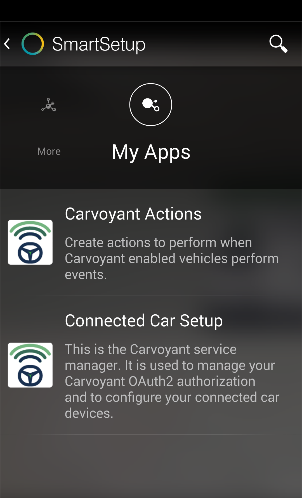

First you must authorize Carvoyant to share data with SmartThings.  Select *Carvoyant Authorization*. This will open up a log in screen in the Carvoyant sandbox environment.  Log in with the driver account credentials that you created earlier. These are the same credentials you used to log in to https://sandbox-driver.carvoyant.com. When you see the confirmation screen, select *Done*.

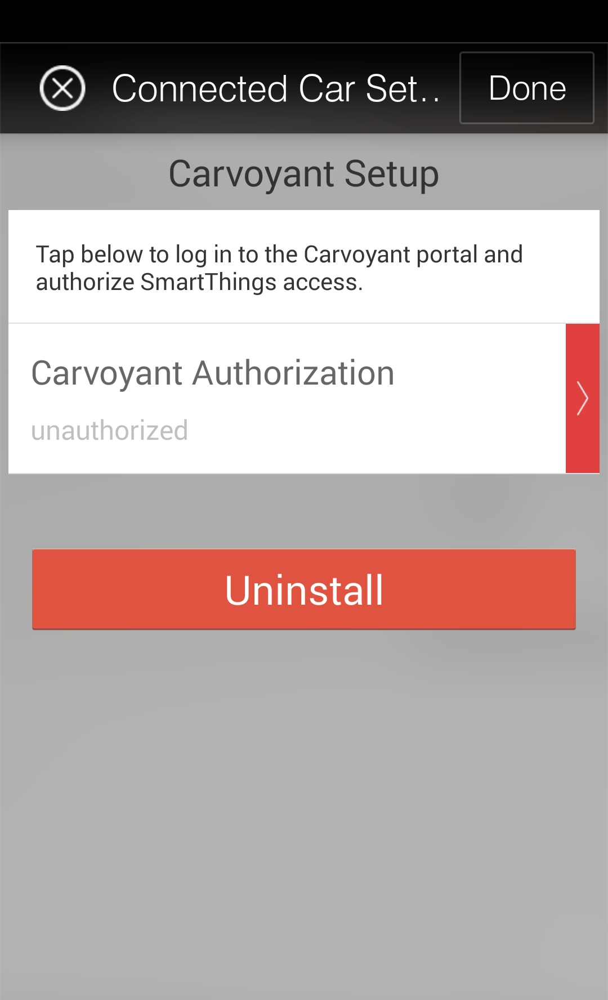

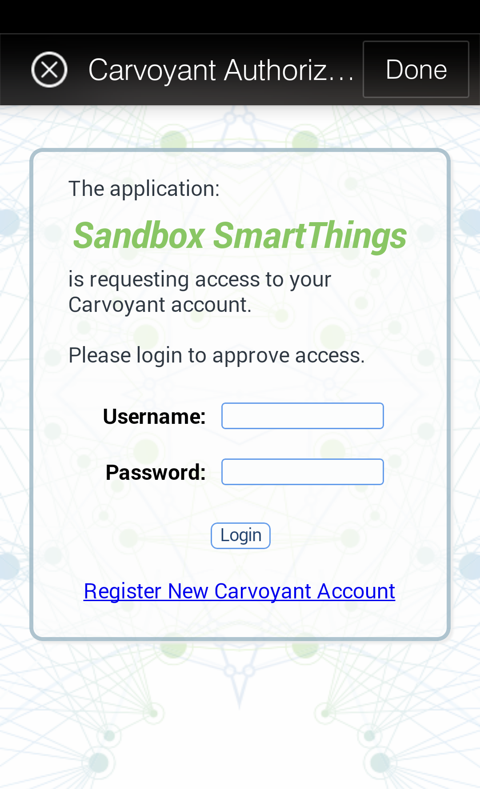

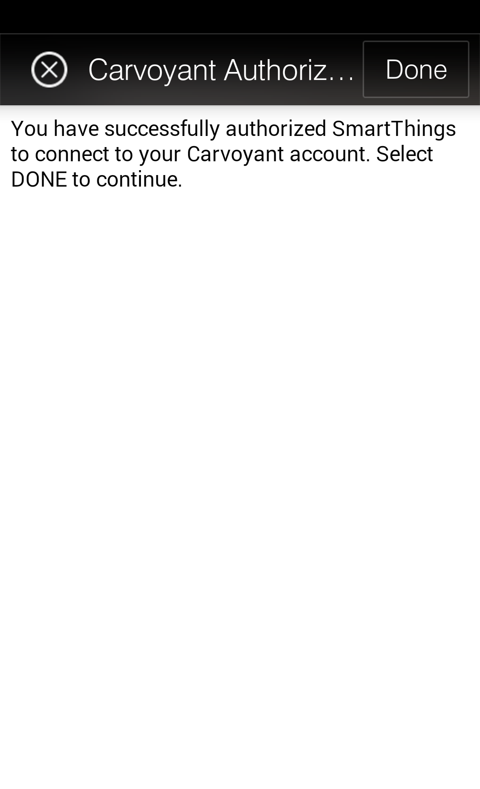

After authorizing Carvoyant to share data, you will be able to select which Carvoyant enable vehicles from your account you want available within SmartThings.  Select one or more vehicles.

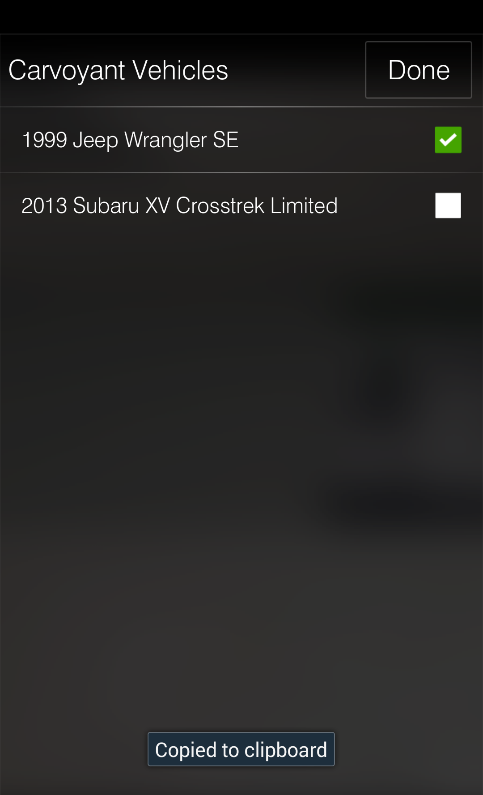
   
Select the vehicles you want to add to SmartThings and then select *Done*

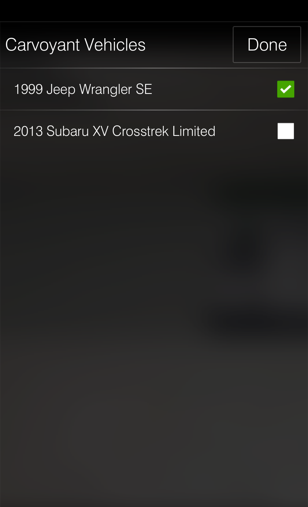

Select the *Done* button in the top right to save your Carvoyant configuration. You will now have a SmartThings *thing* for each of your vehicles.

Configure Some Actions
~~~~~~~~~~~~~~~~~~~~~~

Now that your vehicles are available within SmartThings, it's time to do something with them.  Go back into the *My Apps* screen within the mobile app.  This time, select *Carvoyant Actions*.

These actions are going to be based on our vehicle and our connected bulbs.  Use whatever vehicle and bulbs (or any other switch for that matter) you have available. When you are done setting up these actions, your *My Apps* page will look similar to this:

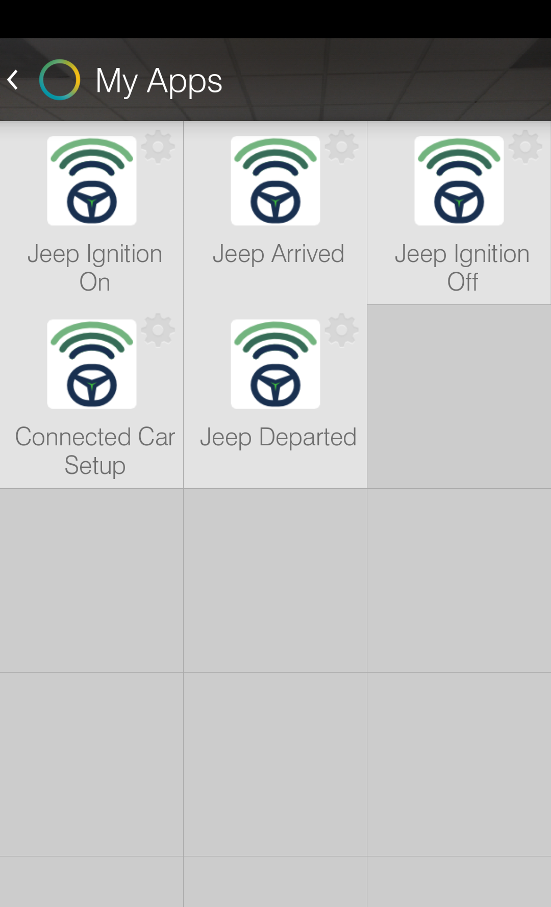

Ignition On
^^^^^^^^^^^

First assign a nick name to this instance of the Carvoyant Actions SmartApp.  This is not absolutely necessary but if you want different actions to happen for different vehicles, you'll need to install multiple copies of the SmartApp. Customizing the name makes it easier to distinguish within the SmartThings mobile application. We're going to call this one "Jeep Ignition On". Then select which vehicle(s) you want these actions to apply to. We are going to select the "1999 Jeep Wrangler". For the Vehicle Event, select "Ignition On".  Note that we have added support for adding in a motion sensor but we're not going to set that up in this example.

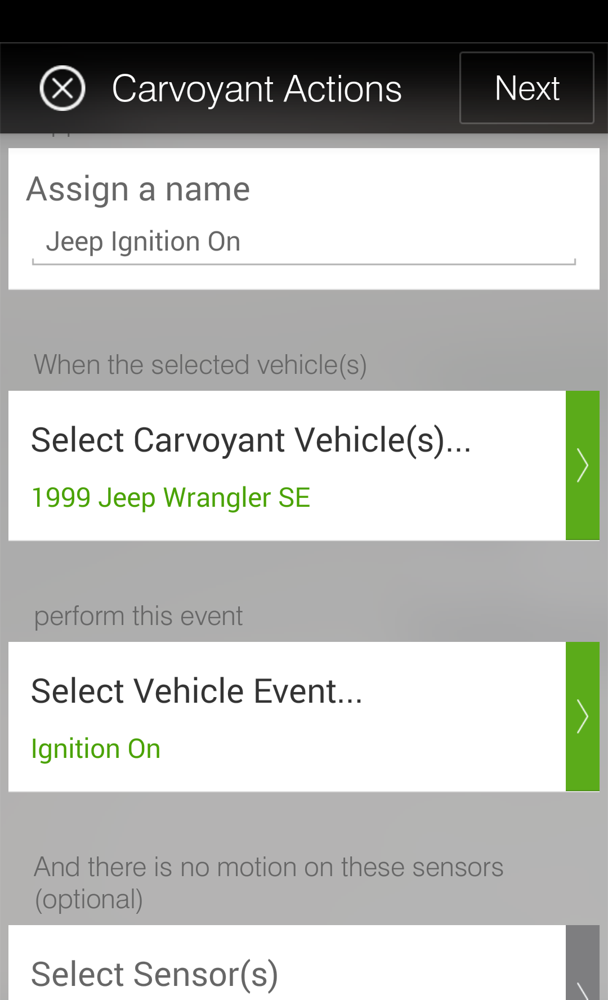

After selecting the vehicle and event type, click *Next*.  On this screen we will configure what happens. Again, we've added support for several different devices types but we're only going to turn on a light.

Select *Next* and you'll be taken to the final screen where you can control whether you want notifications to be sent to you.  We are not going to configure any so just select *Done*

.. image:: smartthings_carvoyant_ignitionon_3.png
   :scale: 25 %
   :align: center

Ignition Off
^^^^^^^^^^^^

The setup for ignition off is exactly the same.  Add a new instance of the Carvoyant Actions SmartApp.  This time title it "Jeep Ignition Off" and select the "1999 Jeep Wrangler". For Vehicle Event, this time we select "Ignition Off".

Select *Next*.  Choose the same bulb from the "Ignition On" setup.  This time, select "Off" for the bulb.

Select *Next* and since we are not configuring notifications, select *Done*.

Vehicle Arrived
^^^^^^^^^^^^^^^

When the vehicle *thing* was created during setup, the SmartApp created a geofence subscription based on the current latitude and longitude of the *Location* that your SmartHub is in. Presence is detected by your vehicle being within 1 mile of that location.

To set up the arrival action, follow the same steps as the ignition status actions.  We will title this one "Jeep Arrival" and we are going to turn "Bulb 2" on.  No notifications will be sent.

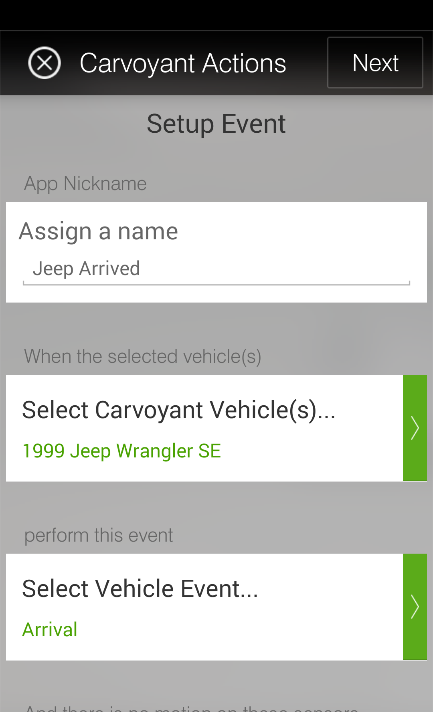

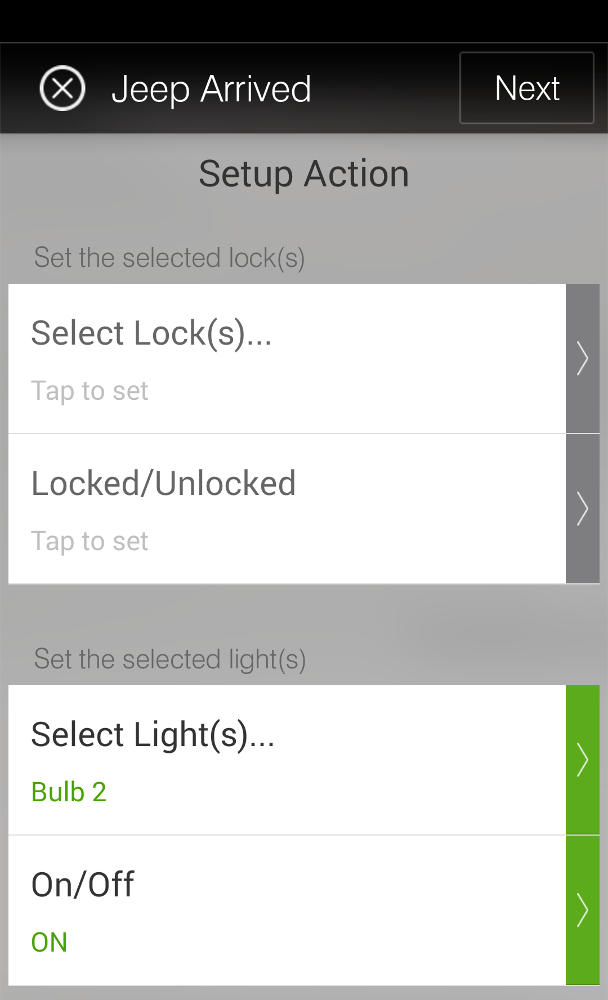

Vehicle Departed
^^^^^^^^^^^^^^^^

To set up the departed action, follow the same steps as the arrival action.  We will title this one "Jeep Departed" and we are going to turn "Bulb 2" off.  No notifications will be sent.

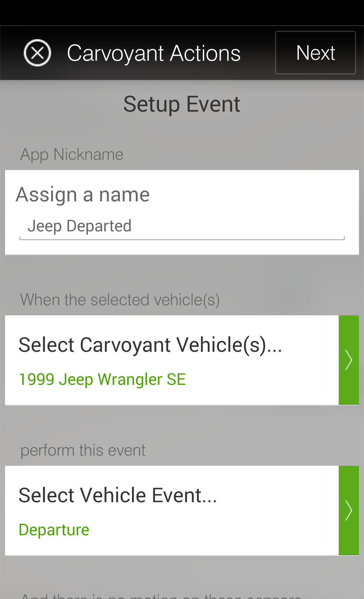

Test It Out
~~~~~~~~~~~

In order to test that your actions are working properly, open up the `Traffic Simulator <https://sandbox-simulator.carvoyant.com>`_ and log in with the same Carvoyant credentials that you authorized within SmartThings.  You are going to simulate two trips, one driving to your location and one driving away from your location. First make sure that the vehicle you are simulating is the same one that you have configured within SmartThings.  You can change it using the drop down in the top right of the screen if necessary.

Driving To Your Location
^^^^^^^^^^^^^^^^^^^^^^^^

Click a point on the map that is greater than 1 mile from your SmartHub Location. Click a second point at your SmartHub Location.  If you want you can change the simulation parameters but for this demonstration the details of the trip do not matter. When your trip is set up, click the *Simulate* button.

When the vehicle "starts" (ie, you begin to see progress on the progress bar), "Bulb 1" will turn on.  As the simulated vehicle reaches 1 mile from your Location, "Bulb 2" will turn on.  When the trip ends, "Bulb 1" will turn off.

Driving Away From Your Location
^^^^^^^^^^^^^^^^^^^^^^^^^^^^^^^

Refresh the screen to start a new trip.  Click the first point at your SmartHub Location. Click the second point at some point greate than 1 mile away from your Location. Click the *Simulate* button.

When the vehicle "starts" (ie, you begin to see progress on the progress bar), "Bulb 1" will turn on.  As the simulated vehicle exceeds 1 mile away from your Location, "Bulb 2" will turn off.  When the trip ends, "Bulb 1" will turn off.

Making It Smarter
-----------------

In order to keep this guide simple, we've chosen to implement only two very basic events from the Carvoyant platform; geofencing and ignition status. The Carvoyant system supports many more events than just those two however. Perhaps you want to signal an alarm in your house if the battery in your car is running low while it's parked outside? Or set an alarm is a certain vehicle in your house is speeding or in an accident? Many of the use cases around a connected car are presence related and can be handled using mobile devices instead but sometimes that's not sufficient. There may also be data collected from the car that can't be detected in other ways that you want to trigger actions within your smart home.

Regardless of why, if you want to extend the functionality to include any of the :doc:`/api-reference/data-type/event-type` notifications that we support, here's how you do it. This expects you to be a lot more familiar with both SmartThings and Carvoyant development than the above guide.

First you need to decide what data it is that you are going to receive from Carvoyant and decide how to store it. You may need to add a *capability* to the *Connected Car Device Type*. Or perhaps simply adding an additional attribue is enough. For ignitionStatus we added a new *attribute*.

Next, decide where to create the Carvoyant event subscriptions.  The geofence and ignition status subscriptions are created within the service manager SmartApp when the vehicle is created. You can create them there if you like. The other alternative is to have the Carvoyant Action SmartApp manage the subscription creation and deletion.  In either case, you'll use the service manager SmartApp to make an API call to Carvoyant with the subscription.

When a notification is generated from Carvoyant for a subscription, it needs a URL to post to. Update the service manager SmartApp and add a new web service mapping. Follow the same pattern that you see for the others. You'll add a method that gets called that will update the attribute on the connected car device.

Now that SmartThings is receiving the events, you'll need to integrate them with your other *things*. You could enhance the *Carvoyant Actions* SmartApp to support the new functionality or you could write your own SmartApp.  The choice is up to you!

Now go have fun connecting your car to the rest of your life!