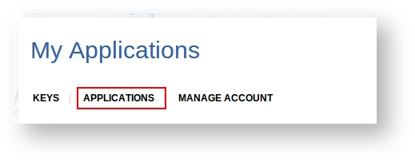
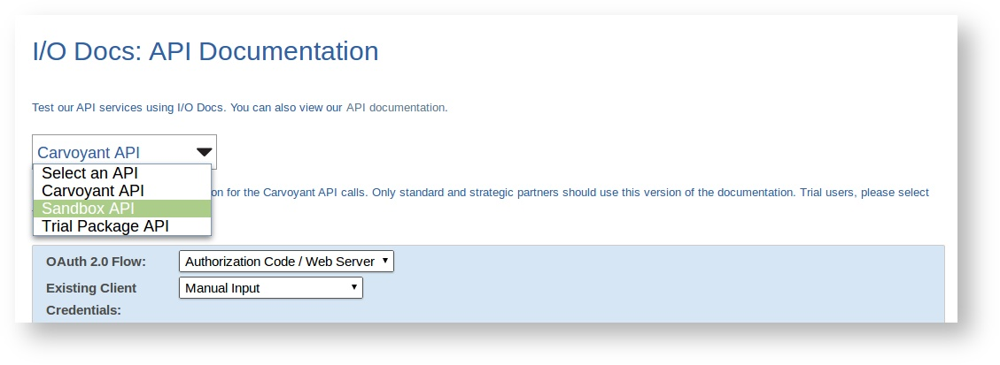
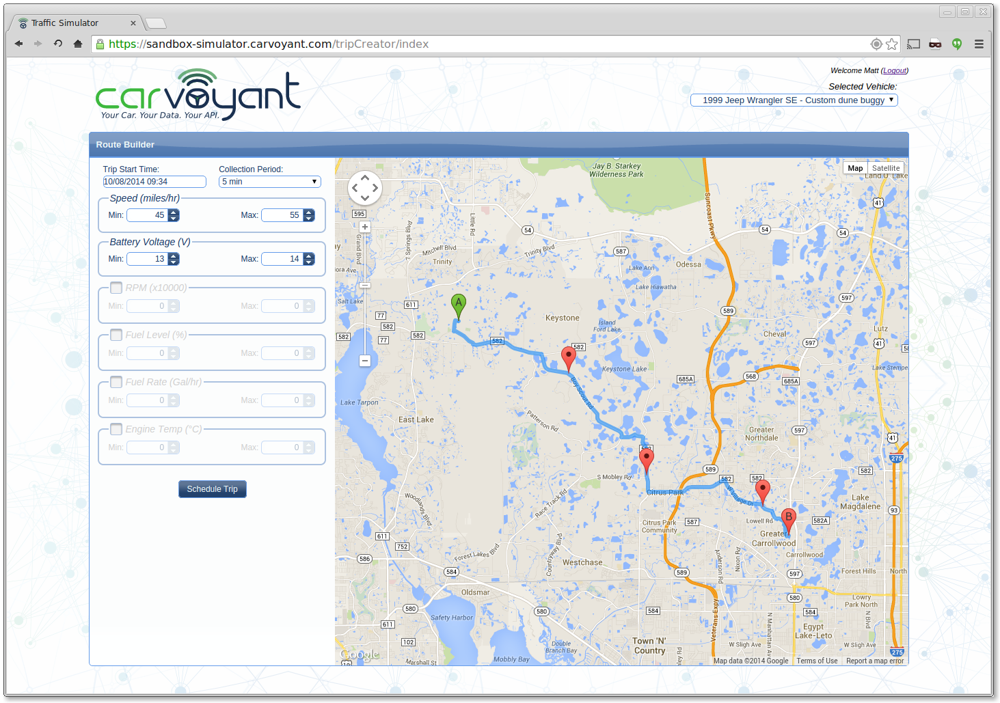

Sandbox API
===========

The Carvoyant Sandbox API provides a good way to build applications against the Carvoyant system without relying on a physical vehicle. This might be because you want to try out the Carvoyant platform before committing to a purchase, or simply because it's easier to develop against a known set of vehicle data. In either case, there are a few things you need to know to get started using it.

The Environment
---------------

The sandbox environment contains all elements of the production environment with the exception of the systems that collect data from actual vehicles on the road (and therefore doesn't support physical devices).  Here are the endpoints that you need to get started:

https://sandbox-driver.carvoyant.com

This is the driver dashboard where you can register a Carvoyant account in the sandbox and create vehicles to test against.

https://sandbox-api.carvoyant.com/sandbox/api

This is the endpoint that you make API requests against.  The resource space effectively matches production.  Anywhere in our documentation where you see https://api.carvoyant.com/v1/api you would replace with https://sandbox-api.carvoyant.com/sandbox/api

https://sandbox-auth.carvoyant.com

This is our OAuth2 authorization endpoint where you can authorize your API to access your sandbox Carvoyant account.

https://sandbox-simulator.carvoyant.com

This is our traffic simulator for generating vehicle data in the sandbox environment.

Provisioning a Key
------------------

If you don't already have a developer account, you will need to register one here: https://developer.carvoyant.com

On the registration screen, make sure that the Sandbox API checkbox is selected:

.. image:: sandbox-provision-key.png

If you already have a developer account you can easily add a sandbox key to it as well.  After logging in, select "My Account" from the top right area and then click the "Applications" heading item:

Next you need to decide whether you want to add the key to an existing application or create a new one. It's probably easier to create a new one.  Decide which you want to do and add the Sandbox API key.

Interactive API
---------------

Just like the production API, you can use the `online interactive API <https://developer.carvoyant.com/io-docs>`_ to make calls against the Sandbox API. After creating your Sandbox API key, switch over to the Interactive API and change the API to Sandbox API.

Vehicle Data
------------

Now that you're all set up to make calls against the Sandbox environment, you need some data!  If you haven't already, add a vehicle to your Carvoyant account (or more than one - or more than one Carvoyant account, whatever you need).  In the Sandbox environment, since there is no actual data collection, there are no hardware devices configured in the system so you will always leave the Device Id on the vehicle blank.

There are two ways that you can load up some data against your sandbox vehicles.

Inbound API
~~~~~~~~~~~

In the sandbox environment, we've opened up the ability for anyone to submit their own data through the API.  This allows you to create very complex trips to meet whatever requirements you have for testing.  An example of the data sets to submit in order to create a simple trip is below.  You would pass each of these, in order, into the dataSet endpoint.  All of them submitted would create a simple trip.  The key is to ensure that the trip starts and contains only a single ignition ON event and ends with an ignition OFF event.  Further, in order to track mileage correctly on the vehicle, you need to ensure that a GEN_TRIP_MILEAGE datum is in the ignition OFF message.

*Sample JSON Messages*::

   {"timestamp":"20140811T140444+0000","ignitionStatus":"ON","datum":[{"timestamp":"20140811T140444+0000","key":"GEN_WAYPOINT","value":"28.027065,-82.588619"},{"timestamp":"20140811T140444+0000","key":"GEN_HEADING","value":323},{"timestamp":"20140811T140444+0000","key":"GEN_VOLTAGE","value":"13.6"}]}
   {"timestamp":"20140811T140943+0000","ignitionStatus":"RUNNING","datum":[{"timestamp":"20140811T140943+0000","key":"GEN_WAYPOINT","value":"28.044153,-82.582672"},{"timestamp":"20140811T140943+0000","key":"GEN_HEADING","value":4},{"timestamp":"20140811T140943+0000","key":"GEN_SPEED","value":"49.8"},{"timestamp":"20140811T140943+0000","key":"GEN_VOLTAGE","value":"13.6"},{"timestamp":"20140811T140943+0000","key":"GEN_RPM","value":"720"},{"timestamp":"20140811T140943+0000","key":"GEN_ENGINE_COOLANT_TEMP","value":"88.0"}]}
   {"timestamp":"20140811T141443+0000","ignitionStatus":"RUNNING","datum":[{"timestamp":"20140811T141443+0000","key":"GEN_WAYPOINT","value":"28.085202,-82.578820"},{"timestamp":"20140811T141443+0000","key":"GEN_HEADING","value":340},{"timestamp":"20140811T141443+0000","key":"GEN_SPEED","value":"46.5"},{"timestamp":"20140811T141443+0000","key":"GEN_VOLTAGE","value":"13.6"},{"timestamp":"20140811T141443+0000","key":"GEN_RPM","value":"2202"},{"timestamp":"20140811T141443+0000","key":"GEN_ENGINE_COOLANT_TEMP","value":"89.0"}]}
   {"timestamp":"20140811T141526+0000","ignitionStatus":"OFF","datum":[{"timestamp":"20140811T141526+0000","key":"GEN_WAYPOINT","value":"28.088426,-82.578569"},{"timestamp":"20140811T141526+0000","key":"GEN_HEADING","value":352},{"timestamp":"20140811T141526+0000","key":"GEN_SPEED","value":"45.9"},{"timestamp":"20140811T141526+0000","key":"GEN_VOLTAGE","value":"12.8"},{"timestamp":"20140811T141526+0000","key":"GEN_RPM","value":"708"},{"timestamp":"20140811T141526+0000","key":"GEN_ENGINE_COOLANT_TEMP","value":"88.0"},{"timestamp":"20140811T141526+0000","key":"GEN_TRIP_MILEAGE","value":"4.3"}]}

Traffic Simulator
~~~~~~~~~~~~~~~~~

Having detailed access to submitting different data is nice, but sometimes you just want to simulate a couple of simple trips.  To do that, we've created a simulation tool that allows you to select the vehicle you want, enter some points on a map, adjust some basic parameters if you want to, and then process the trip against your vehicle.  This will send the data over just like a real vehicle would.

Open a web browser to https://sandbox-simulator.carvoyant.com and log in with your Carvoyant user credentials.  Once you're logged in, set up a trip by clicking the start and end point on the map.  When it's all set, click "Schedule Trip" and your trip will be sent to the Carvoyant platform.

